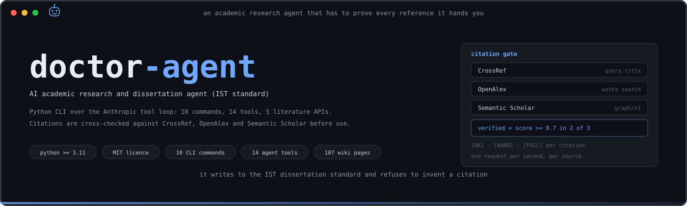
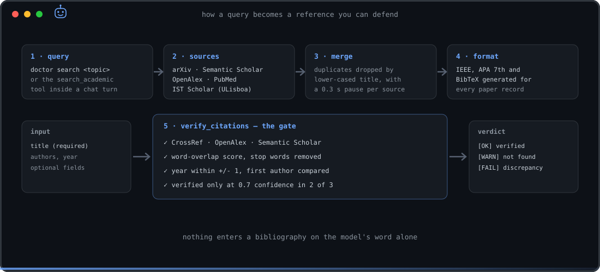
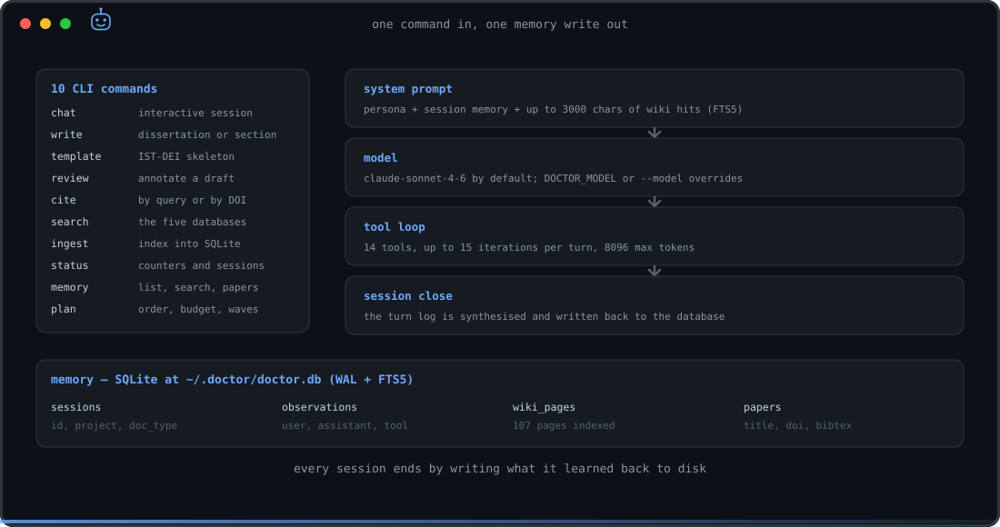
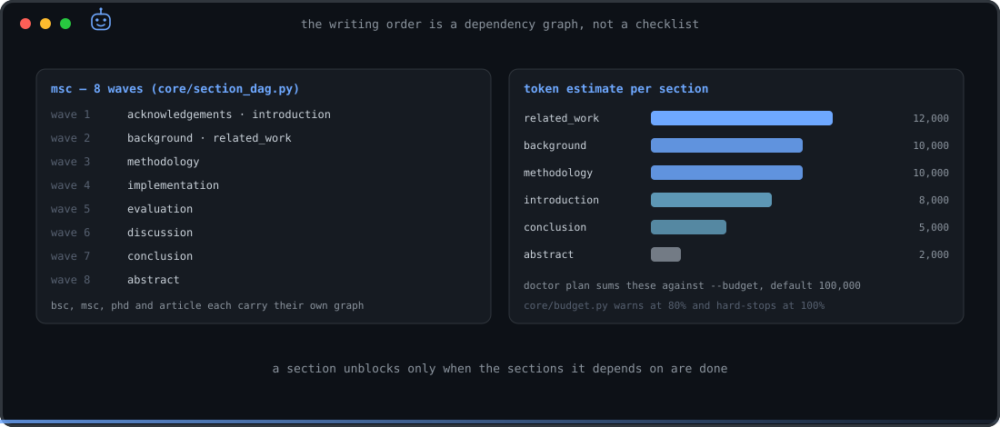
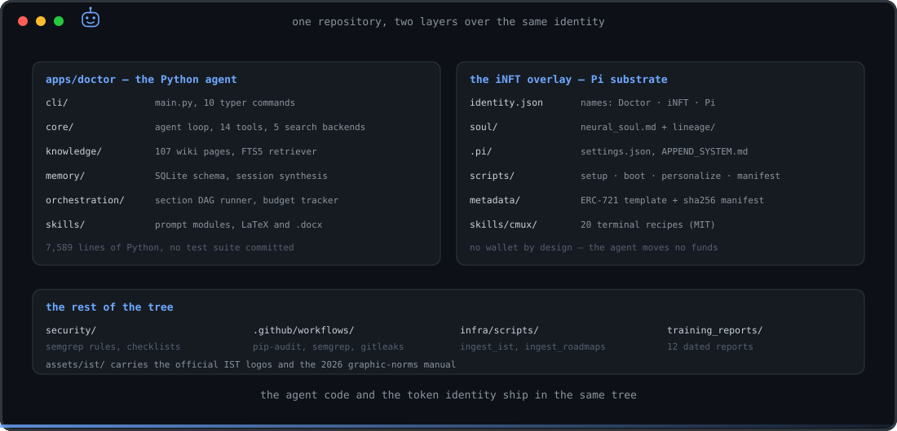

<p align="center">
  
</p>

<p align="center">
  
  
  
  
  
  
</p>

# Doctor

**Doctor** is an academic research and scientific-writing agent that runs in a terminal.
It searches real literature databases, formats and **verifies** references, drafts and reviews
dissertation sections against the Instituto Superior Técnico (IST Lisboa) standard, and keeps
everything it learns in a local SQLite database.

It is built for one job: engineering dissertations, theses and conference papers in machine
learning, deep learning and cloud architecture. The word *Doctor* here means a doctoral
supervisor — the agent has no clinical role, and PubMed appears below only as one more
bibliographic index.

The design rule that shapes the whole codebase: **a reference that cannot be found in at least
two independent databases does not get printed as verified.**

---

## Install and run

Requires Python 3.11+ and an Anthropic API key. No key is needed for the literature APIs.

```bash
git clone https://github.com/devclone20/doctor-agent
cd doctor-agent
python3 -m venv .venv && source .venv/bin/activate
pip install -e .
```

The key is read from the environment, or from a `.env` file in the repo root (or in the
directory you run from):

```bash
export ANTHROPIC_API_KEY=sk-...
doctor status
```

Then:

```bash
doctor chat --project "Federated Learning IoT" --type msc
doctor search "deep learning time series" --source arxiv --from 2022
doctor cite --query "federated learning IoT" --sources arxiv,semantic --limit 15
doctor cite --doi "10.1038/nature14539" --style bibtex
doctor write "Transformer architectures" --type article --section introduction --lang en
doctor review dissertation.md --type citations
doctor template --type msc --output template.md
doctor plan "Federated Learning for IoT anomaly detection" --type msc
```

Generated files land in `~/doctor-work/` unless `--output` says otherwise. Memory lives in
`~/.doctor/doctor.db` (override with `DOCTOR_MEMORY_DIR`). The model defaults to
`claude-sonnet-4-6` and is overridden by `DOCTOR_MODEL` or `--model`.

### Commands

| Command | What it does |
|---|---|
| `chat` | Interactive session with streaming, tools and persistent memory |
| `write` | Full dissertation or a single section; Markdown or LaTeX; `--style ist-dissertation` |
| `template` | Prints or saves the IST-DEI skeleton (`msc`, `phd`, `bsc`, `meic-2024`) |
| `review` | Annotates a draft: `full`, `structure`, `citations`, `language`, `technical` |
| `cite` | References by topic or by DOI, formatted IEEE, APA 7th or BibTeX |
| `search` | Direct query against the literature databases, with `--from YEAR` filter |
| `ingest` | Indexes papers or a URL into the local knowledge base |
| `status` | Wiki pages, indexed papers, session and observation counters |
| `memory` | `list`, `search`, `papers` over what previous sessions produced |
| `plan` | Section order, dependencies, token estimate and budget for a document |

Document types are `bsc`, `msc`, `phd` and `article`; output language is `pt` or `en`.

---

## How a reference is produced

<p align="center">
  
</p>

Search is multi-source and de-duplicated by lower-cased title, with a short pause between
providers to stay polite:

| Source key | Service | Endpoint |
|---|---|---|
| `arxiv` | arXiv API, restricted to `cs.LG, cs.AI, cs.CV, cs.CL, cs.DC` | `export.arxiv.org/api/query` |
| `semantic` | Semantic Scholar Graph API | `api.semanticscholar.org/graph/v1` |
| `openalex` | OpenAlex, filtered to `type:article` | `api.openalex.org/works` |
| `ist` | OpenAlex filtered to Universidade de Lisboa (`I141596103`) — the IST Scholar view | `api.openalex.org/works` |
| `pubmed` | NCBI E-utilities, `esearch` then `esummary` | `eutils.ncbi.nlm.nih.gov` |
| DOI / title lookup | CrossRef Works | `api.crossref.org/works` |

Every result carries an IEEE string, an APA 7th string and a BibTeX entry, built locally from
the record — never from memory.

The `verify_citations` tool (`apps/doctor/core/citation_pipeline.py`) then re-queries CrossRef,
OpenAlex and Semantic Scholar for each citation, scores word overlap between the claimed title
and each hit with stop words removed, tolerates a one-year difference (preprint versus
published), compares the first author, and marks a citation **verified only at a confidence of
0.7 or higher in at least two of the three sources**. Everything else comes back as `[WARN]` or
`[FAIL]` with the discrepancy spelled out. Each source is throttled to one request per second.

---

## The session loop

<p align="center">
  
</p>

Each turn builds its system prompt from three parts: the fixed persona in
`core/identity.py`, a memory context built from previous sessions, and up to 3000 characters
retrieved by full-text search over the bundled wiki. The turn then runs the Anthropic tool
loop — 14 tools, at most 15 tool iterations, 8096 max output tokens — and streams the answer.
When the session ends, it is synthesised and written back to the database.

The 14 tools: `search_academic`, `fetch_paper`, `lookup_doi`, `cite_from_title`,
`verify_citations`, `manage_bibliography`, `search_memory`, `save_learning`, `search_web`,
`read_file`, `write_file`, `list_files`, `sanitize_document`, `run_command`.

Two of them are deliberately fenced:

- `run_command` refuses a blocklist of destructive commands and then only accepts an
  allowlist of prefixes — `lualatex`, `pdflatex`, `xelatex`, `biber`, `bibtex`, `ls`, `cat`,
  `head`, `tail`, `echo`, `pwd`, `find`, `grep`, `python`, `python3`, `pip`, `pip3`, `wc` —
  with a 60-second timeout.
- `write_file` and `read_file` resolve relative paths inside `~/doctor-work/`.

The knowledge base is 107 markdown pages under `apps/doctor/knowledge/wiki/` — IST standards
and templates, scientific writing, citation styles, ML and cloud notes, security checklists,
plus a `roadmaps/` tree of 89 files. Files are re-indexed only when their mtime changes.

Two sanitisers guard what leaves the agent: `docx_sanitizer.py` strips author, company,
comments and residual track-changes from generated `.docx` files and redacts credential-shaped
strings; `latex_sanitizer.py` blocks shell-escape constructs (`\write18`, `minted`, `gnuplot`,
`includesvg`) and path traversal in `\input`.

---

## Planning a long document

<p align="center">
  
</p>

`core/section_dag.py` holds a dependency graph per document type. `doctor plan` resolves it
topologically (Kahn), groups the sections into waves that could be written in parallel, prices
each section from a table of token estimates, and compares the total against `--budget`
(default 100,000 tokens). `core/budget.py` tracks tokens and tool calls per agent, warns at 80% and stops
at 100%.

The orchestrator behind it (`orchestration/dissertation_orchestrator.py`) serialises its state
to JSON, so an interrupted run can be resumed. It is reached only through
`create_orchestrator(backend="stdlib", ...)`; the `"langgraph"` backend is declared in the
protocol and raises `NotImplementedError` by design.

---

## Map

<p align="center">
  
</p>

```
apps/doctor/
  cli/main.py            10 typer commands
  core/                  agent loop · 14 tools · academic_search · citation_pipeline
                         identity (persona) · section_dag · budget · project_state
  knowledge/             FTS5 retriever + wiki/ (107 markdown pages, 89 in roadmaps/)
  memory/                SQLite schema (WAL + FTS5) and session synthesis
  orchestration/         DAG-driven dissertation runner, orchestrator protocol
  skills/                prompt modules: dissertation · review · citation · latex_export
                         latex_sanitizer · docx_sanitizer · bibliography_manager
identity.json            names: Doctor · iNFT · Pi
soul/                    neural_soul.md and soul/lineage/ (append-only provenance)
.pi/                     Pi wiring: settings.json + APPEND_SYSTEM.md
scripts/                 setup · boot · personalize · install-command · make-manifest
metadata/                ERC-721 metadata template + sha256 manifest of tracked files
skills/cmux/             20 terminal recipes (MIT, third party)
security/                semgrep rules, pip-audit config, supply-chain checklists
infra/scripts/           ingest_ist.py, ingest_roadmaps.py
assets/ist/              official IST logos and the 2026 graphic-norms manual
training_reports/        12 dated self-training reports
docs/                    BOOTSTRAP.md · INFT_CONCEPT.md · assets/
```

About 7,600 lines of Python under `apps/`.

### The second layer

This repository is also the body of an **iNFT** — an agent fused with an NFT, where whoever
holds the token holds the agent — forged from the
[inft-i01](https://github.com/devclone20/inft-i01) template. Underneath the name runs a
[Pi coding agent](https://github.com/earendil-works/pi) (BYOK), carrying the Doctor soul:

```bash
bash scripts/setup.sh            # install the pinned Pi substrate (no sudo, --ignore-scripts)
pi                               # then /login to connect your own model key
bash scripts/boot.sh             # boot with soul + skills trusted (pi -a)
bash scripts/install-command.sh  # then type `doctor` in the CLONE FRAME iT terminal
```

Note that both layers claim the same command name: `pyproject.toml` installs a `doctor` console
script, and `install-command.sh` writes a `doctor` launcher into `~/.clone-frame-hub/bin` and
`~/.local/bin`. PATH order decides which one answers.

Details: [`INFT.md`](INFT.md) · [`AGENTS.md`](AGENTS.md) · [`docs/INFT_CONCEPT.md`](docs/INFT_CONCEPT.md).
`identity.json` records no wallet and no economic capability — that is deliberate, and
`AGENTS.md` forbids adding one.

After changing any tracked file under `soul/`, `docs/`, `.pi/`, `skills/` or `identity.json`,
run `scripts/make-manifest.sh` to regenerate `metadata/manifest.json`.

---

## Integrity and limits

The persona in `core/identity.py` is not decoration; these are its stated absolute rules:

- never fabricate results or references;
- when it does not know, say so and search instead of inventing;
- never cite anything it has not verified;
- the work belongs to the user — the agent assists, it does not substitute.

Read that alongside the honest limits:

- Output is a **draft**. Section text is emitted with explicit `[PLACEHOLDER: ...]` markers
  where the author must supply experimental data, figures or numbers.
- Verification checks that a reference *exists and matches* — not that the claim it supports
  is true.
- The CLI, prompts and persona are written in Portuguese; generated documents follow `--lang`
  (`pt` or `en`).
- **No test suite is committed.** Treat the orchestration and prototype modules
  (`supervisor_prototype.py`, `training_dag.py`) as such.

## Security

- `.github/workflows/security.yml` runs pip-audit, Semgrep (standard rulesets plus the custom
  rules in `security/semgrep_rules.yaml`) and a full-history Gitleaks scan on every push and
  pull request to `main`, and again every Monday at 06:00 UTC, ending in a consolidated report.
- `.pre-commit-config.yaml` adds Gitleaks, detect-secrets against a baseline, optional
  ggshield, Bandit and hygiene hooks. Install with `pip install pre-commit && pre-commit install`.
- The repository is public: no keys, no `.env`, no owner profile. `scripts/personalize.sh
  --apply-owner` folds the owner profile into `.pi/APPEND_SYSTEM.md` **locally** and untracks it.

## Status

Version 1.0.0, `doctor-agent` on Python 3.11+. The CLI, the search and citation pipelines, the
memory layer and the stdlib orchestrator are implemented and usable; the LangGraph backend and
the supervisor prototypes are not.

## Licence

MIT, declared in `package.json`. `skills/cmux/` is vendored under its own MIT licence and
retains its copyright notice.
