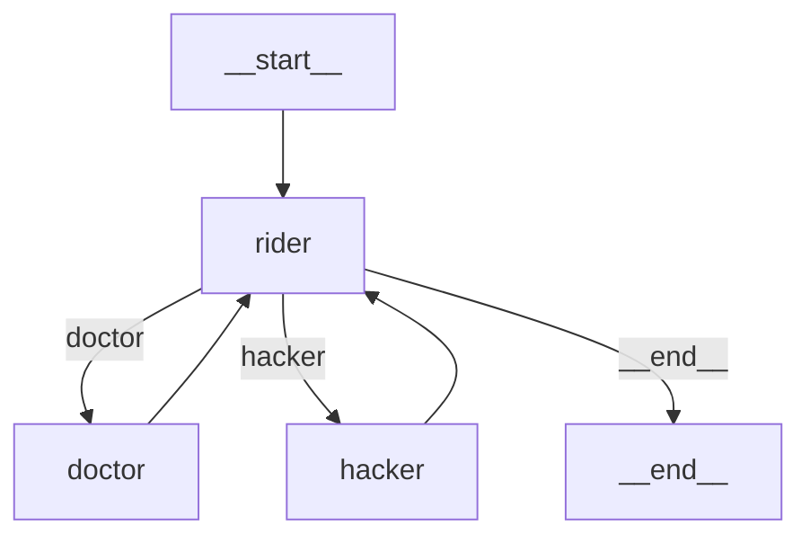
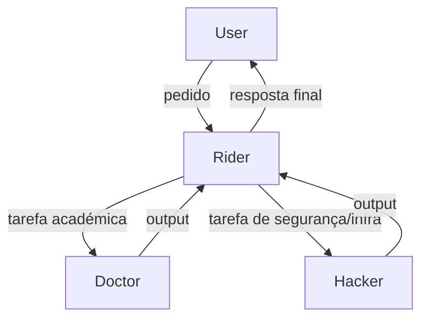

# Spike: LangGraph para Orquestração Doctor-Hacker-Rider

> Análise técnica do uso de LangGraph como substituto ou complemento à orquestração
> actual do sistema multi-agente Doctor-Hacker-Rider.
> Data: Junho 2026 | Status: Spike concluído — recomendação no final

---

## Contexto

O sistema actual tem três agentes especializados:
- **Doctor** — supervisor académico, pesquisa, escrita e formatação de documentos
- **Hacker** — segurança, análise de vulnerabilidades, infra e DevSecOps
- **Rider** — orquestrador, coordena tarefas entre Doctor e Hacker, gere contexto

A questão é: LangGraph oferece vantagens reais face à orquestração actual?

---

## O que é LangGraph

LangGraph é uma biblioteca da LangChain Inc. (licença MIT) que permite modelar workflows
de agentes como grafos dirigidos (potencialmente cíclicos). Cada nó é uma função Python.
As arestas são transições entre nós, condicionais ou incondicionais.

**Repositório:** https://github.com/langchain-ai/langgraph
**Versão analisada:** 0.2.x (Junho 2026)
**Dependência core:** `langgraph` (não requer `langchain` — pode ser usado standalone)

---

## Arquitectura de Grafos — Conceitos Base

```
StateGraph
│
├── Nodes (funções Python que transformam o state)
│     ├── doctor_node(state) → state
│     ├── hacker_node(state) → state
│     └── rider_node(state) → state
│
├── Edges (transições entre nós)
│     ├── Unconditional: doctor → hacker
│     └── Conditional: rider → {doctor | hacker | END}
│
└── State (TypedDict partilhado entre todos os nós)
      ├── messages: list[BaseMessage]
      ├── current_task: str
      ├── agent_output: dict
      └── next_agent: str
```

---

## Modelar Doctor→Hacker→Rider como Grafo LangGraph

### State Definition

```python
from typing import TypedDict, Annotated, Literal
from langgraph.graph import StateGraph, END
from langgraph.graph.message import add_messages

class AgentState(TypedDict):
    # Histórico de mensagens (append-only via add_messages reducer)
    messages: Annotated[list, add_messages]
    # Tarefa actual em processamento
    current_task: str
    # Agente que deve processar a seguir
    next_agent: Literal["doctor", "hacker", "rider", "__end__"]
    # Output do último agente a correr
    last_output: str
    # Contexto acumulado do projecto
    project_context: dict
```

### Node Definitions

```python
import anthropic

client = anthropic.Anthropic()

DOCTOR_SYSTEM = "Lê doctor.md"   # em produção: carregar do ficheiro
HACKER_SYSTEM = "Lê hacker.md"
RIDER_SYSTEM  = "Lês rider.md"


def doctor_node(state: AgentState) -> AgentState:
    """Nó do Doctor: tarefas académicas."""
    response = client.messages.create(
        model="claude-sonnet-4-6",
        max_tokens=8192,
        system=DOCTOR_SYSTEM,
        messages=[{"role": "user", "content": state["current_task"]}]
    )
    output = response.content[0].text
    return {
        **state,
        "last_output": output,
        "messages": [{"role": "assistant", "content": f"[Doctor]: {output}"}],
        "next_agent": "rider",  # sempre devolve ao Rider após processar
    }


def hacker_node(state: AgentState) -> AgentState:
    """Nó do Hacker: segurança, infra, DevSecOps."""
    response = client.messages.create(
        model="claude-sonnet-4-6",
        max_tokens=8192,
        system=HACKER_SYSTEM,
        messages=[{"role": "user", "content": state["current_task"]}]
    )
    output = response.content[0].text
    return {
        **state,
        "last_output": output,
        "messages": [{"role": "assistant", "content": f"[Hacker]: {output}"}],
        "next_agent": "rider",
    }


def rider_node(state: AgentState) -> AgentState:
    """Nó do Rider: orquestrador — decide quem chama a seguir."""
    # O Rider analisa a tarefa e o output anterior e decide o próximo passo
    decision_prompt = f"""
Tarefa original: {state['current_task']}
Último output: {state['last_output']}

Com base no output anterior, decide:
- Se a tarefa está completa: responde com "DONE"
- Se precisa do Doctor (académico): responde com "DOCTOR: <subtarefa>"
- Se precisa do Hacker (segurança/infra): responde com "HACKER: <subtarefa>"
"""
    response = client.messages.create(
        model="claude-sonnet-4-6",
        max_tokens=1024,
        system=RIDER_SYSTEM,
        messages=[{"role": "user", "content": decision_prompt}]
    )
    decision = response.content[0].text.strip()

    if decision.startswith("DONE"):
        return {**state, "next_agent": "__end__"}
    elif decision.startswith("DOCTOR:"):
        subtask = decision[7:].strip()
        return {**state, "current_task": subtask, "next_agent": "doctor"}
    elif decision.startswith("HACKER:"):
        subtask = decision[7:].strip()
        return {**state, "current_task": subtask, "next_agent": "hacker"}
    else:
        # Fallback: terminar se decisão não reconhecida
        return {**state, "next_agent": "__end__"}
```

### Graph Construction

```python
from langgraph.graph import StateGraph, END


def build_graph() -> StateGraph:
    graph = StateGraph(AgentState)

    # Adicionar nós
    graph.add_node("doctor", doctor_node)
    graph.add_node("hacker", hacker_node)
    graph.add_node("rider", rider_node)

    # Ponto de entrada: sempre começa no Rider
    graph.set_entry_point("rider")

    # Doctor e Hacker devolvem sempre ao Rider
    graph.add_edge("doctor", "rider")
    graph.add_edge("hacker", "rider")

    # Rider decide o próximo passo condicionalmente
    graph.add_conditional_edges(
        "rider",
        lambda state: state["next_agent"],
        {
            "doctor": "doctor",
            "hacker": "hacker",
            "__end__": END,
        }
    )

    return graph.compile()


# Uso
app = build_graph()

result = app.invoke({
    "messages": [],
    "current_task": "Revê a segurança da minha dissertação e identifica vulnerabilidades no deployment",
    "next_agent": "rider",
    "last_output": "",
    "project_context": {},
})
```

### Visualização do Grafo

```python
# LangGraph suporta geração de diagrama Mermaid
from IPython.display import Image, display

display(Image(app.get_graph().draw_mermaid_png()))
```

Output Mermaid esperado:


---

## LangGraph vs. CrewAI vs. Claude Agent SDK

| Dimensão | LangGraph | CrewAI | Claude Agent SDK |
|---|---|---|---|
| **Modelo de orquestração** | Grafo explícito (código) | Agentes + Tasks + Crews (YAML/código) | Subagents + tool_use (nativo Anthropic) |
| **Visibilidade do fluxo** | Alta — grafo é código | Média — abstracção sobre o fluxo | Baixa — fluxo implícito nas ferramentas |
| **Controlo fino** | Total — cada transição é explícita | Parcial — CrewAI gere o routing | Total — cada tool call é explícita |
| **Suporte a ciclos** | Sim — grafo cíclico nativo | Limitado | Sim — via recursão de tools |
| **Estado partilhado** | TypedDict explicito e tipado | Shared memory (menos tipado) | Context window (implícito) |
| **Debugging** | LangSmith tracing | Verbose logs | Claude.ai trace |
| **Persistência** | Checkpointers (SQLite, Redis) | Não nativo | Não nativo |
| **Latência** | Baixa (sem overhead de abstracção) | Média | Baixa |
| **Curva de aprendizagem** | Moderada | Baixa | Baixa (se já usas Anthropic API) |
| **Lock-in** | LangChain ecosystem | CrewAI ecosystem | Anthropic ecosystem |
| **Compatibilidade com Claude** | Sim (qualquer LLM) | Sim (qualquer LLM) | Nativa Anthropic |
| **Multimodal** | Sim | Sim | Sim (nativo) |
| **Tool calling** | Via LangChain tools | Via CrewAI tools | Via Anthropic tool_use (nativo) |

---

## Trade-offs — LangGraph no contexto Doctor-Hacker-Rider

### Vantagens

1. **Fluxo explícito e auditável.** O grafo é código Python — qualquer engenheiro lê e entende o routing sem inferir de logs.
2. **Estado tipado.** `AgentState` como `TypedDict` garante que o estado entre agentes é bem definido e verificável com mypy.
3. **Suporte a ciclos.** O padrão Rider→Doctor→Rider→Hacker→Rider é um ciclo — LangGraph modela isso nativamente.
4. **Checkpointing.** Permite retomar workflows interrompidos — útil para tarefas longas (dissertação completa).
5. **Visualização.** `draw_mermaid_png()` gera diagrama do fluxo — útil para documentação de dissertação.

### Desvantagens

1. **Dependência adicional.** `langgraph` adiciona ~15MB ao bundle e traz o ecosystem LangChain como dependência transitiva.
2. **Overhead de setup.** Para 3 agentes simples, LangGraph pode ser over-engineering. O padrão actual com Claude Agent SDK é mais directo.
3. **Versioning instável.** LangGraph está em desenvolvimento activo — APIs mudam entre minor versions.
4. **Não é nativo Anthropic.** Tool use e structured outputs do Claude funcionam melhor com o SDK oficial.
5. **Debugging cross-tool.** Integrar LangSmith (tracing do LangGraph) com o tracing do Anthropic SDK cria fricção.

---

## Recomendação Final

**Para o Doctor-Hacker-Rider: não adoptar LangGraph como orquestrador principal.**

**Razão:** o Claude Agent SDK já fornece o primitivo correcto — `tool_use` + subagents.
O Rider como hub que invoca Doctor e Hacker via tools é mais simples, mais directo, e
mantém o ecossistema Anthropic-native (melhor tracing, melhor structured output, menos
dependências).

**Quando reconsiderar LangGraph:**
- Se o número de agentes crescer para 5+ com fluxos complexos que precisam de visualização
- Se for necessário checkpointing (retomar workflows multi-hora)
- Se o projecto migrar para multi-provider (misturar Claude + GPT-4 + Gemini num workflow)

**Alternativa imediata:** documentar o grafo do workflow actual como diagrama Mermaid
(sem implementar LangGraph) — obtém-se o benefício de visibilidade sem a dependência.


